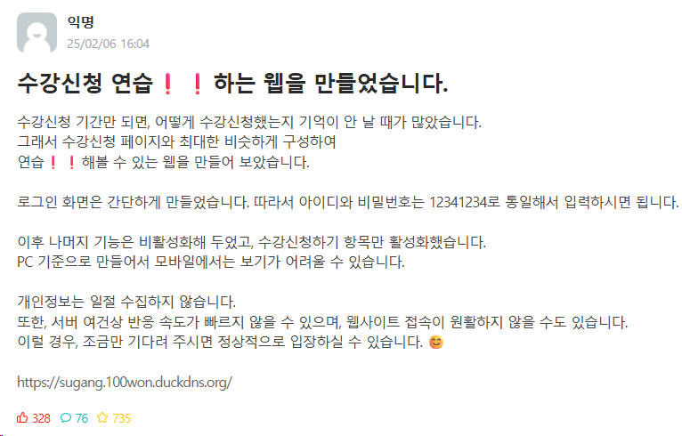

# 수강신청 연습 웹 서비스

실제 대학교 수강신청 환경을 모방하여  
사용자가 수강신청 과정을 연습할 수 있도록 만든 웹 서비스입니다.  
빠른 응답성과 실서비스 운영 경험을 목표로 개인 프로젝트로 진행했습니다.

## 링크
https://sugang_regacy.dapdap.duckdns.org/

## 화면

## 프로젝트 개요

- **개발 기간**: [2025.02 ~ 2025.03]
- **개발 인원**: 1명 (개인 프로젝트)
- **목적**
  - 실제 사용자 트래픽을 고려한 웹 서비스 설계
  - 빠른 응답을 위한 기술 선택 및 배포 경험
  - Docker 기반 서비스 운영 경험 확보

---

## 사용 기술 스택

- **Backend**: Flask (Python)
- **Frontend**: HTML / CSS / JavaScript
- **Infra / DevOps**
  - Docker
  - Linux (Ubuntu)
  - Nginx
- **Deployment**
  - Oracle Cloud Infrastructure (Compute Instance)
  - Custom Domain(DuckDns) 연결

---

## 주요 기능

- 수강신청 페이지 UI 제공 (실제 수강신청 화면과 유사한 흐름)
- 과목 선택 및 신청 시뮬레이션
- 신청 결과 즉시 반영 (빠른 응답 처리)
- 다수 사용자 동시 접근 환경 고려
- HTML5의 LocalStorage를 통해 사용자화
---

## 설계 포인트

### 1. DB를 사용하지 않은 이유
- 수강신청 연습 서비스 특성상 **데이터 영속성이 필수적이지 않다고 판단**
- 단순 CRUD보다 **실제 사용성 및 성능**을 우선 고려한 설계

---

### 2. 배포 및 운영 방식
- Flask 애플리케이션을 Docker 컨테이너로 구성
- Nginx를 통해 외부 요청 처리
- 도메인 연결을 통해 실제 사용자 접근 가능하도록 구성

---

## 실제 운영 및 트래픽 경험

- 서비스 배포 후 실제 사용자 유입 발생
- 게시판 및 커뮤니티 공유를 통해 약 **700명 규모의 사용자 요청 처리**

> 단순 기능 구현이 아닌,  
> **실제 사용자가 있는 서비스를 운영하며 발생하는 트래픽을 경험**하는 것을 목표로 했습니다.
